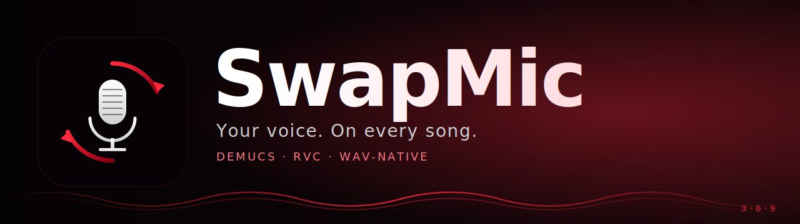

<p align="center">
  
</p>

<p align="center">
  <a href="#install"></a>
  <a href="LICENSE"></a>
  
  
</p>

# SwapMic

Drop a song in. Get back the same song with **your** voice on lead.

SwapMic is a clean, opinionated wrapper around [Demucs](https://github.com/facebookresearch/demucs) (source separation) and [RVC](https://github.com/RVC-Project/Retrieval-based-Voice-Conversion-WebUI) (voice conversion). The models exist; the UX doesn't. SwapMic is the missing CLI + REST + drag-drop layer.

```
input.wav  ──►  Demucs  ──►  vocals.wav  ──►  RVC (your model)  ──►  vocals.you.wav
                       └──►  instrumental.wav ─────────────────────────┐
                                                                       ▼
                                                            ◄────  remix  ────►  output.swapmic.wav
```

Everything stays **24-bit WAV** end-to-end. No silent MP3 downgrades.

## Why

The pieces have been on Hugging Face for years. Most people never get past the install. SwapMic is the polished surface — a real CLI, a real REST API, a sane defaults pipeline — so you can spend your time singing instead of fighting environments.

## Features

- **One command, one song, one output.** `swapmic swap song.wav --model voice.pth`
- **Demucs** for clean vocal/instrumental split (4-stem `htdemucs` by default)
- **RVC** for the voice swap — bring your own trained model
- **Loudness-matched remix** — converted vocal lands where the original sat in the mix
- **WAV-native** at 24-bit throughout. No re-encoding.
- **Two backends** for RVC: native [`rvc-python`](https://pypi.org/project/rvc-python/) or shell out to your own CLI
- **REST server** for hooking into anything (web UI, DAW plugin, your assistant)

## Install

> SwapMic needs Python 3.10+, FFmpeg on `PATH`, and a CUDA-capable GPU for reasonable speed (CPU works but is glacial).

```bash
git clone https://github.com/<you>/SwapMic.git
cd SwapMic
pip install -e .
```

You also need an RVC backend. Easiest:

```bash
pip install rvc-python
```

Or set `SWAPMIC_RVC_CLI` to a script that runs your existing RVC install.

## Quickstart

```bash
# 1. Train an RVC model of your voice once (use any RVC trainer; ~15–20 min of clean audio).
#    You'll end up with my_voice.pth and my_voice.index.

# 2. Swap any song:
swapmic swap song.wav --model my_voice.pth --index my_voice.index

# Output lands at output/song.swapmic.wav
```

Useful flags:

| Flag | Default | What it does |
|---|---|---|
| `--pitch` | `0` | Semitones to shift. `+12` male→female, `-12` the other way. |
| `--index-rate` | `0.75` | How hard to lean on the speaker `.index` file (timbre fidelity). |
| `--protect` | `0.33` | Protects voiceless consonants from artifacts (raise if hissy). |
| `--f0` | `rmvpe` | Pitch extractor. `rmvpe` is the modern best. |
| `--vocal-gain-db` | `0.0` | Trim the converted vocal in the final mix. |
| `--peak-dbfs` | `-1.0` | Final mix ceiling. Output is true-peak limited to this. |

## REST API

```bash
uvicorn swapmic.server:app --host 127.0.0.1 --port 3699
```

Then:

```bash
# List installed RVC models (from $SWAPMIC_MODELS_DIR)
curl http://127.0.0.1:3699/models

# Swap a song
curl -X POST http://127.0.0.1:3699/swap \
  -F "song=@my_song.wav" \
  -F "model=my_voice" \
  -F "pitch=0" \
  --output out.wav
```

## Library use

```python
from pathlib import Path
from swapmic.pipeline import SwapConfig, swap

result = swap(
    "my_song.wav",
    SwapConfig(model_path=Path("my_voice.pth"), index_path=Path("my_voice.index")),
)
print(result.final)
```

## Roadmap

- [ ] Drag-and-drop web UI on top of the REST server
- [ ] Optional polish pass through a vocal chain (de-ess, EQ, plate reverb, limiter)
- [ ] Built-in trainer wrapper so SwapMic can produce the `.pth` itself
- [ ] Stem-aware remix (sidechain compression, vocal bus EQ)
- [ ] Batch mode for albums

## Credits & licenses

- [Demucs](https://github.com/facebookresearch/demucs) — MIT
- [RVC](https://github.com/RVC-Project/Retrieval-based-Voice-Conversion-WebUI) — Apache-2.0
- SwapMic itself — Apache-2.0 (see [LICENSE](LICENSE))

Use trained voice models you have the rights to use. Don't be a jerk.
